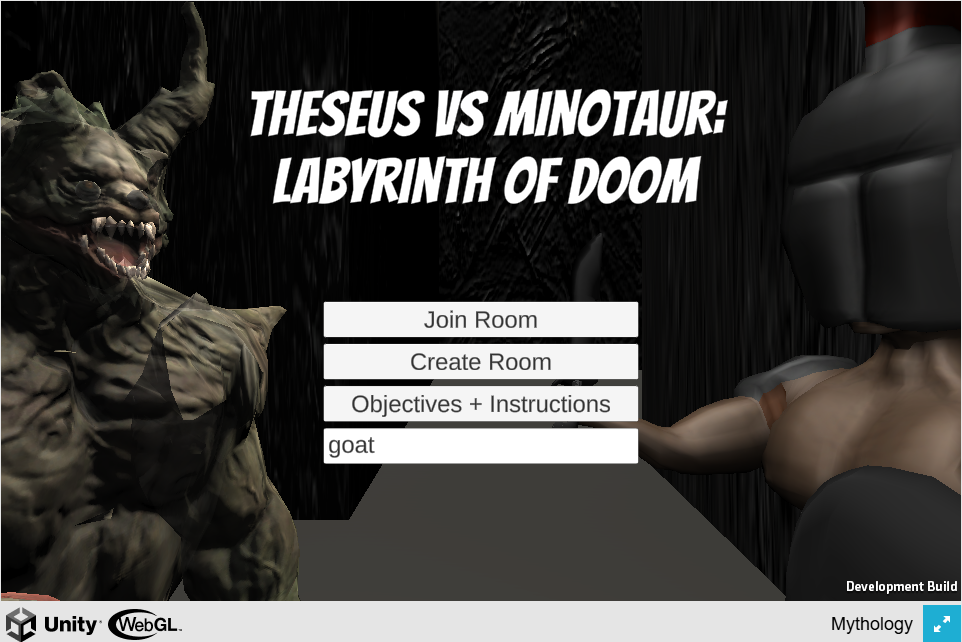
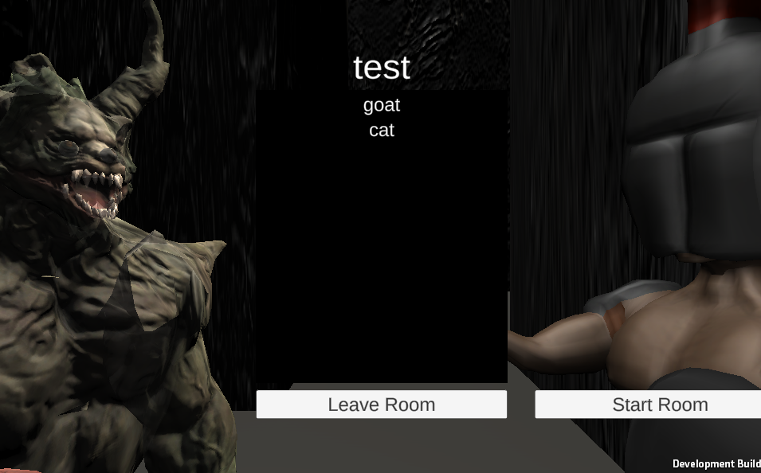
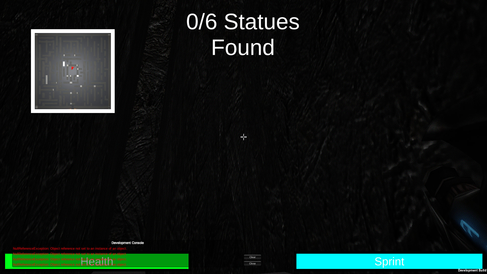
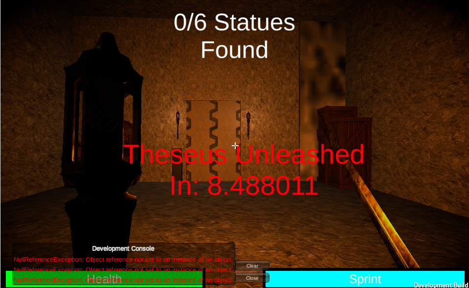

# labyrinth-of-doom

**Labyrinth of Doom** is a real-time multiplayer maze adventure built with Unity and Photon PUN 2. Team up with fellow heroes to navigate the treacherous  maze and find statues scattered around to escape, or play  as the treacherous  minotaur and swing his mighty axe to eliminate intruders before they can reach all six statues.
With seamless online multiplayer, you can challenge friends or match with players globally in a battle of wits and speed. 

**Play the WebGL Build on itch.io:** [https://ltaker.itch.io/labyrinth-of-dooms3](url)

## Features

-  **Multiplayer Support** using Photon PUN 2
-  Real-time lighting and shadows
-  Smooth character movement and animations
-  Competitive gameplay mechanics
-  Modular and expandable architecture

**Note: The original game files were unfortunately corrupted. However, the assets and All project files in this repository represent what has been successfully recovered.
All core scripts written by me were preserved and can be found in the ExportedProject/Assets/Scripts/Assembly-CSharp/ directory. The rest of the scripts hold placeholder content for the lost code.**

**Instructions**
## How to Play

### Set Up
The WebGl build of the game is available on itch.io: [https://ltaker.itch.io/labyrinth-of-dooms3](url). Create your unique username and have the host create a room. All other players must join  the host's room using the "join room" feature

### All Players
- **Movement**: Use `W`, `A`, `S`, `D` to move.
- **Attack**: Left-click to swing your weapon.
- **Sprint**: Hold `Shift` to sprint. Sprint bar is shown at the bottom right. It recharges over time.
- **Health**: Health does **not** regenerate. Keep an eye on the health bar at the bottom left.
- **Respawn**: There is no respawn — once you're dead, you're out.

---

### Minotaur
- Automatically designated as the lobby creator.
- Has **more health** than the heroes.
- **Attack**: Left-click for a powerful axe swing  (Higher damage, slower swings)
- **Sprint**: Hold `Shift` for short bursts of speed (shorter than heroes' sprint).
- **Vision**: Can see clearly in the dark.
- **Tracking**: Players are revealed on your map with a red marker occasionally.
- **Revealed Statues**: When heroes interact with a statue, an exclamation mark appears at the location — use this to track them down.

---

### Heroes
- Use your **torch** to light the way — you can’t see much beyond it.
- **Attack**: Left-click to use your sword (lower damage, faster swings).
- **Strategy**: The Minotaur can hear your footsteps. Be cautious and communicate with teammates.
- **Vision**:  Wields a torch that illuminates the way, but may also reveal their location
- **Win Conditions**:
  - Kill the Minotaur with your sword (difficult),
  - **Or** pray at all altars (statues) to make the Minotaur fall asleep.
- **Praying**: Hit statues to activate them. Once activated, they light up.
  - ⚠️ **Warning**: Hitting a statue reveals its location to the Minotaur!
- **Group Up**: Teaming up improves survival chances.
- **Special Ability**: Press `R` to teleport back to spawn using woollen twine. This can only be used once per game.

## 🎮 Demo / Gameplay

## 🛠️ Tech Stack

| Category         | Tool / Technology                |
|------------------|----------------------------------|
| Game Engine      | [Unity](https://unity.com/) (URP)|
| Programming      | C#                               |
| 3D Modeling      | [Blender](https://www.blender.org/) & Free online assets|
| UI               | Unity UI Toolkit, TextMeshPro    |
| Version Control  | Git, [GitHub](https://github.com)|
| Multiplayer      | [Photon PUN 2](https://www.photonengine.com/pun) |

## 📄 License

This project is licensed under the [MIT License](https://opensource.org/licenses/MIT).
